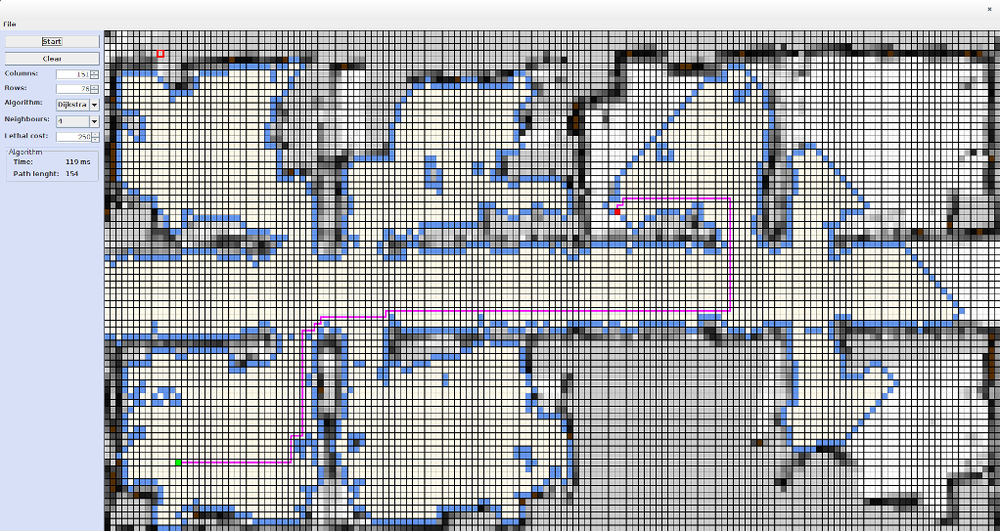

## Pathfinder ##

Pathfinder is a project to be used to learn about pathfinding algorithms (based on grid maps). It uses an user interface to provide interaction with pathfinding algorithms:

* load map (supported file formats: bmp, png, jpeg, wbmp, gif, pgm),
* save map (supported file formats: bmp),
* change the position of the start node,
* change the position of the end node,
* ... .

Currently supported algorithms

* Breadth-First-Search
* Dijkstra
* Greedy-Breadth-First-Search
* A-Star



Running the example
------------------

If you want to see an user interface, type the following:

```
javac *.java
java PathFinder
```

Examples of maps are located under **maps** directory ([*] http://pr.willowgarage.com/data/maps/).

